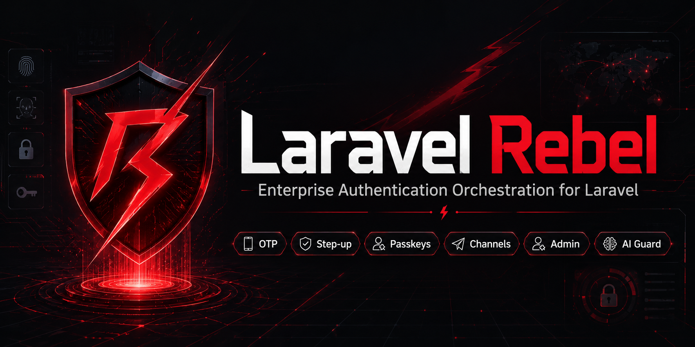
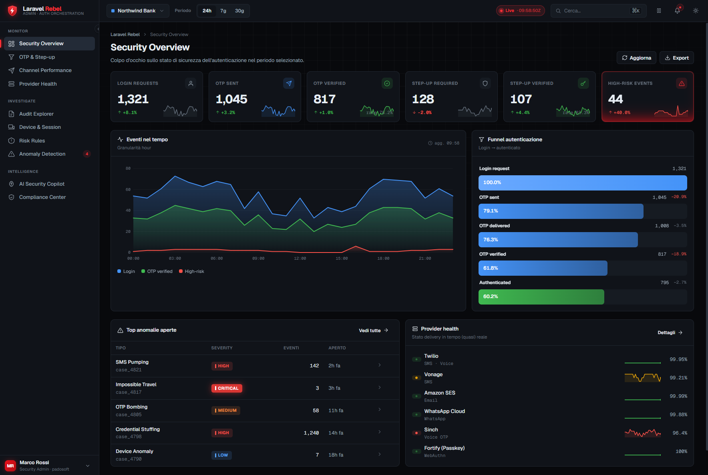

# Laravel Rebel — Enterprise Authentication, the way Shopify wishes it did it

> **Passwordless, passkey-first, risk-based authentication for Laravel — a control plane over Fortify.** Email-OTP & passkey login (web + mobile via Sanctum), risk-based step-up with **PSD2/SCA dynamic linking**, multi-channel verification with anti toll-fraud, refresh-token rotation with reuse detection, device trust, recovery codes, anomaly detection with an advisory AI, a web admin panel, and NIST/PSD2/GDPR-aware compliance — modular, multi-tenant, and PHPStan-max across the board.

<p align="center">
  
</p>

<p align="center">
  
  
  
  
  
  
  
</p>

---

## Table of contents

- [What Laravel Rebel is](#what-laravel-rebel-is)
- [Rebel vs Shopify vs the rest — the card-battle](#rebel-vs-shopify-vs-the-rest--the-card-battle)
- [The package map](#the-package-map)
- [Dependency DAG](#dependency-dag)
- [What you can do, end to end](#what-you-can-do-end-to-end)
- [Narrated flows](#narrated-flows)
- [Web Admin Panel](#web-admin-panel)
- [Install](#install)
- [Compliance](#compliance)
- [Quality bar](#quality-bar)
- [License](#license)

---

## What Laravel Rebel is

**Rebel is the control plane for authentication.** Laravel Fortify gives you the plumbing
(login, 2FA enrolment, passkeys); Rebel adds the *policy, intelligence and operations* on top:

- **Passwordless & passkey-first** login — email-OTP and WebAuthn, for web **and** mobile
  (Laravel Sanctum access + refresh tokens).
- **Risk-based step-up** — require the *right strength* (NIST AAL/AMR) per action, with
  **PSD2/SCA dynamic linking** for payments.
- **Multi-channel verification** — SMS/WhatsApp/voice through pluggable providers (Twilio…),
  with **anti toll-fraud/IRSF** defences and provider fallback.
- **Session security** — refresh-token rotation with **reuse detection**, logout-everywhere,
  device trust.
- **Recovery** — single-use, HMAC-hashed backup codes.
- **Intelligence** — deterministic anomaly detection + an AI that **explains, never decides**.
- **Operations** — a permission-gated, tenant-aware admin API + a web panel.

Every piece is its own composer package: take only what you need, or the whole suite via this
meta-package.

---

## Rebel vs Shopify vs the rest — the card-battle

How Rebel's auth stacks up against **Shopify**'s customer auth, Laravel **Fortify** alone, and
**Sanctum/Passport** tokens:

| Capability | **Laravel Rebel** | Shopify (customer auth) | Fortify only | Sanctum / Passport |
|---|:---:|:---:|:---:|:---:|
| Passwordless email-OTP login | ✅ | ✅ | ❌ | ❌ |
| Passkey-first (WebAuthn) login | ✅ | ➖ | ✅ | ❌ |
| Mobile tokens (access + **refresh**) | ✅ | ➖ | ❌ | ➖ (Sanctum: no refresh) |
| Refresh-token **rotation + reuse detection** | ✅ | ❌ | ❌ | ❌ |
| **Risk-based step-up** (per-action AAL/AMR) | ✅ | ❌ | ❌ | ❌ |
| **PSD2/SCA dynamic linking** (amount+payee) | ✅ | ❌ | ❌ | ❌ |
| SMS/WhatsApp/voice with provider **fallback** | ✅ | ➖ | ❌ | ❌ |
| **Anti toll-fraud / IRSF** defences | ✅ | ➖ | ❌ | ❌ |
| Device trust (remembered devices) | ✅ | ✅ | ❌ | ❌ |
| Single-use, hashed **recovery codes** | ✅ | ✅ | ➖ | ❌ |
| **Anomaly detection** + advisory AI | ✅ | ➖ (opaque) | ❌ | ❌ |
| Unified, HMAC'd **audit trail** | ✅ | ➖ | ❌ | ❌ |
| **Web admin panel** for security ops | ✅ | ✅ (Shopify-hosted) | ❌ | ❌ |
| NIST AAL / PSD2 / GDPR aware | ✅ | ➖ | ❌ | ❌ |
| **Multi-tenant** | ✅ | ❌ | ❌ | ❌ |
| **Self-hosted, you own the data** | ✅ | ❌ | ✅ | ✅ |
| PHPStan **max**, Pest-tested, modular | ✅ | n/a | ➖ | ➖ |

> Legend: ✅ built-in · ➖ partial / hosted-only / DIY · ❌ not available · n/a closed-source.
> Shopify is a great hosted product — but it's a black box you don't control or extend. Rebel
> gives you the same capabilities (and several Shopify doesn't have, like PSD2/SCA dynamic
> linking and refresh-token reuse detection) **in your own Laravel app, self-hosted, auditable,
> and multi-tenant.**

---

## The package map

| Package | What it does |
|---|---|
| [`laravel-rebel-core`](https://github.com/padosoft/laravel-rebel-core) | The shared language: assurance (AAL/AMR), security context, contracts, keyed hashing, audit log, tenancy. |
| [`laravel-rebel-email-otp`](https://github.com/padosoft/laravel-rebel-email-otp) | Passwordless email-OTP login (anti-enumeration, rate limit, atomic verify, Sanctum tokens). |
| [`laravel-rebel-bridge-fortify`](https://github.com/padosoft/laravel-rebel-bridge-fortify) | Exposes Fortify password/TOTP/passkey as step-up drivers + maps Fortify events to the audit. |
| [`laravel-rebel-step-up`](https://github.com/padosoft/laravel-rebel-step-up) | Per-action step-up with AAL/AMR enforcement and **PSD2/SCA dynamic linking**. |
| [`laravel-rebel-channels`](https://github.com/padosoft/laravel-rebel-channels) | Verification routing (SMS/WhatsApp/voice): bot gate, anti-IRSF, rate limit, provider fallback. |
| [`laravel-rebel-channel-twilio`](https://github.com/padosoft/laravel-rebel-channel-twilio) | Twilio Verify provider for the channels layer (live-tested). |
| [`laravel-rebel-sessions`](https://github.com/padosoft/laravel-rebel-sessions) | Session/refresh-token registry: rotation + **reuse detection**, logout-everywhere, device trust. |
| [`laravel-rebel-recovery`](https://github.com/padosoft/laravel-rebel-recovery) | Single-use, HMAC-hashed recovery (backup) codes. |
| [`laravel-rebel-ai-guard`](https://github.com/padosoft/laravel-rebel-ai-guard) | Deterministic anomaly detection + an AI that **explains, never decides**. |
| [`laravel-rebel-admin-api`](https://github.com/padosoft/laravel-rebel-admin-api) | Permission-gated, tenant-aware control-plane read API (metrics, funnels, audit explorer). |
| [`laravel-rebel-admin`](https://github.com/padosoft/laravel-rebel-admin) | The web admin panel (Blade + vanilla JS) over the admin API. |
| [`laravel-rebel-auth`](https://github.com/padosoft/laravel-rebel-auth) | **This meta-package** — installs and ties the suite together. |
| *Optional providers/bridges* | `channel-vonage`, `channel-bird`, `channel-telegram`, `channel-discord`, `bridge-passkeys`, `bridge-spatie-otp`, `bridge-laragear-2fa`, `bridge-otpz`, `bot-protection`. |

---

## Dependency DAG

```
                         laravel-rebel-core
                                 |  (assurance, contracts, audit, tenancy, keyed hashing)
       +--------------+----------+---------------+---------------+-------------+
       v              v          v               v               v             v
  email-otp        channels   sessions        recovery       ai-guard      admin-api
       |              |                                                        |
       v              v                                                        v
  step-up  <----------+ (email-otp driver)                                  admin (web panel)
       ^
       | (StepUpDriver contract)
  bridge-fortify --> channel-twilio --> channels      (providers/bridges plug in)
```

Install order follows the arrows: **core first**, then the leaves; `channel-twilio` after
`channels`; `admin` after `admin-api`.

---

## What you can do, end to end

- **Log a customer in without a password** — email -> OTP -> access + refresh token (mobile) or
  session (web); or **passkey-first** with email-OTP fallback.
- **Force a strong re-auth before a risky action** — "this checkout needs a phishing-resistant
  passkey", bound to the exact amount + payee (PSD2/SCA).
- **Send verifications safely** — across SMS/WhatsApp/voice with provider fallback, geo
  allowlist and per-prefix circuit breaker so toll-fraud can't drain your budget.
- **Detect token theft** — a replayed refresh token burns the whole session.
- **Recover lost access** — single-use backup codes behind a high-assurance step-up.
- **See and explain what's happening** — a tenant-aware admin panel with metrics, funnels and
  an audit explorer, plus deterministic anomaly cases an AI can narrate.

---

## Narrated flows

**1) Customer passwordless login (mobile)**

```
POST /login {email}  -> email-otp: send code (anti-enumeration, rate-limited)
POST /verify {code}  -> atomic single-use verify -> LoginResult -> Sanctum access + refresh tokens
                        (refresh tokens tracked by laravel-rebel-sessions, rotated on use)
```

**2) Checkout of a credit order (PSD2/SCA)**

```
POST /checkout  -> middleware rebel.stepup:checkout-credit-order
                   policy: AAL2 + phishing-resistant -> only a passkey qualifies
                   step-up bound to (amount, currency, payee, orderRef) via HMAC dynamic linking
user confirms with passkey (bridge-fortify driver) -> binding matches -> order proceeds
                   if the amount changes -> binding_mismatch -> re-authenticate
```

**3) Account recovery**

```
user lost device -> submits a recovery code (laravel-rebel-recovery, single-use, hashed)
                    gated behind a high-assurance step-up purpose -> access restored
                    every step audited; anomalies (e.g. many failures) raise an ai-guard case
```

---

## Web Admin Panel

A security-operations dashboard ([`laravel-rebel-admin`](https://github.com/padosoft/laravel-rebel-admin))
sits on top of the admin API: security overview, OTP/step-up funnels, channel performance,
provider health, audit explorer, device & session trust, risk rules, anomaly cases, an AI
copilot, and a compliance center — light/dark, tenant-aware, fail-closed.

<p align="center">
  
</p>

---

## Install

Install the whole suite via this meta-package:

```bash
composer require padosoft/laravel-rebel-auth
```

…or cherry-pick the packages you need (each has its own quick-start README). Optional channel
providers and bridges are listed under `suggest` — e.g. add Twilio:

```bash
composer require padosoft/laravel-rebel-channel-twilio
```

Then publish migrations/config from the packages you use and run `php artisan migrate`. Each
package's README has a junior-proof, copy-paste quick start.

---

## Compliance

- **NIST 800-63B**: explicit AAL/AMR on every factor; passkeys are phishing-resistant; step-up
  enforces the required assurance and decays it on policy change.
- **PSD2/SCA**: dynamic linking binds a strong confirmation to amount + payee; the binding is a
  keyed HMAC with key rotation.
- **GDPR**: identifiers and IPs are stored as keyed HMACs (never plaintext); audit metadata is
  sanitized; AI prompts are scrubbed of PII/secrets.

---

## Quality bar

Every package in the suite ships with: **PHPStan level max**, **Pest** tests, **Pint** code
style, a CI matrix across **PHP 8.3 / 8.4 / 8.5 × Laravel 12 / 13**, a didactic README with a
competitor comparison, and a full local + dual-bot (Codex + Copilot) review on every release.

---

## License

MIT — see [LICENSE](LICENSE). Built by [Padosoft](https://www.padosoft.com).
